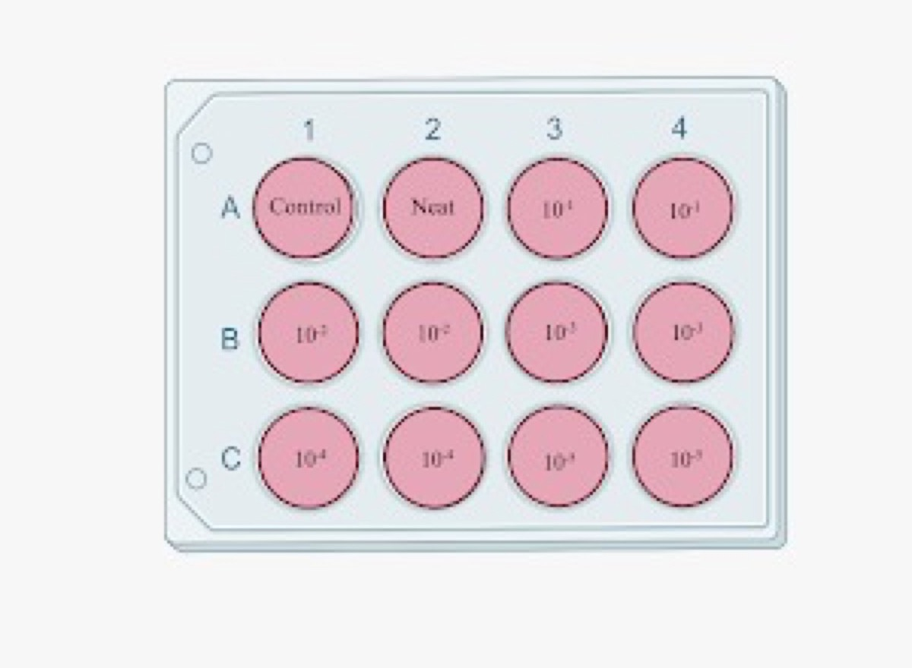
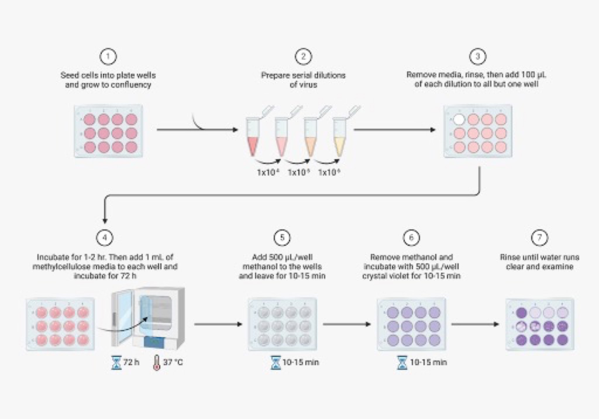

### Theory

A plaque assay is based on the principle that each plaque formed represents one infectious virus particle in the sample. The plaques are the infectious units and cellular dead zones. Plaque assay is the direct quantification of infectious virus particles through counting discrete plaques in cell culture. The semi-solid overlay medium (agar or methylcellulose) restricts viral diffusion, ensuring that the virus spreads only to neighbouring cells through direct contact.

  

Figure 1. Illustration of Plaque assay.

 

  

Figure 2. 1. Seeding of cells in 12 well plate, 2. Virus serial dilution, 3. Infection in seeded cells, 4. Incubation for 2-3 days, 5. Fixation of cells, 6. Staining the cells, 7. Washing and visualization Confluent monolayer of BHK-21 cells showing distinct viral plaques (clear zones)

 

The plaque assay remains the gold standard for the quantification of infectious viruses in research, vaccine development, and diagnostic applications.